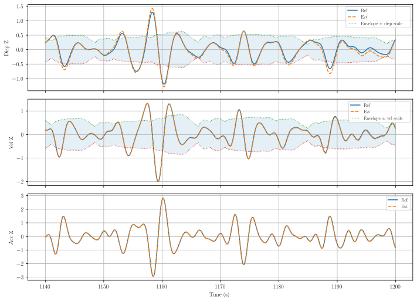
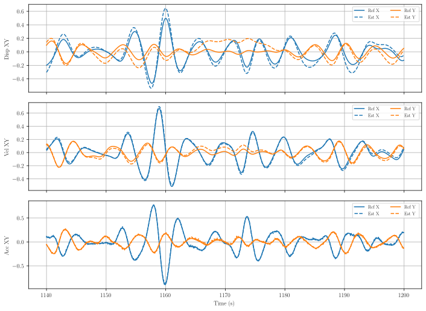
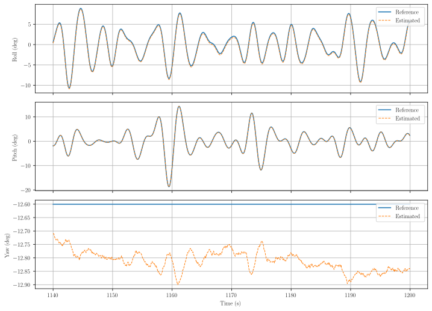
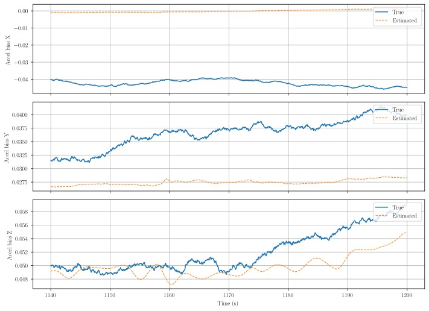
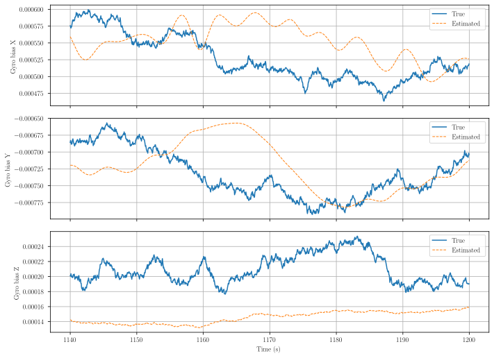
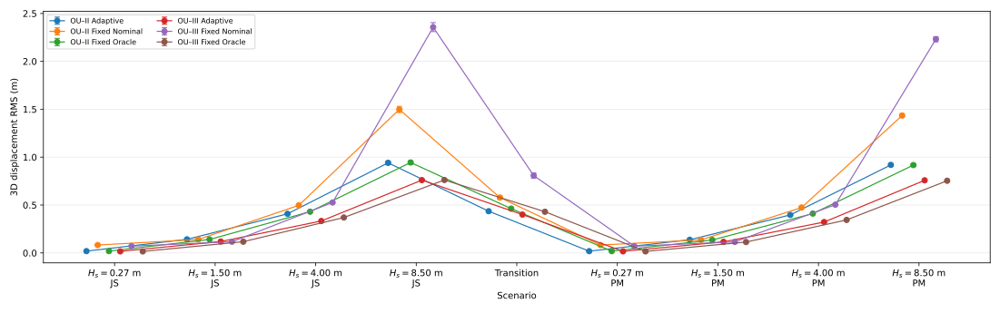
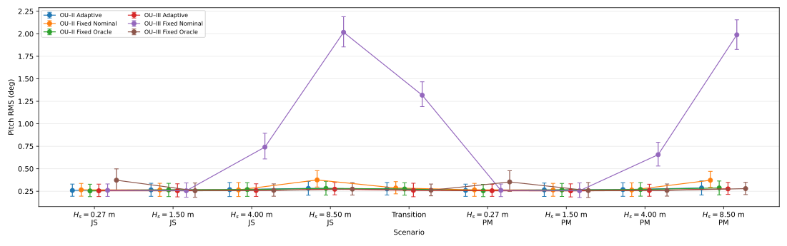
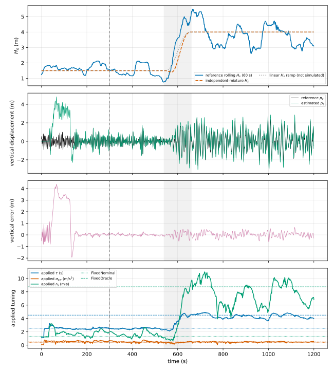
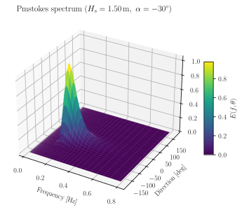
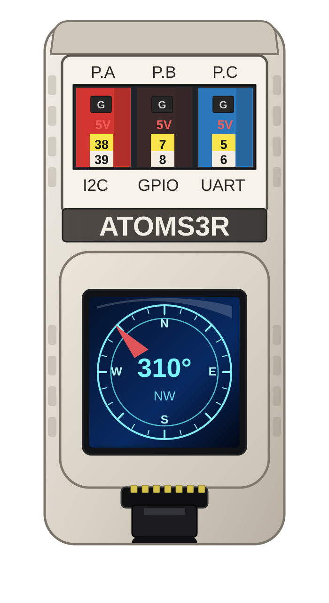

# ocean-imu

Marine IMU and wave-processing algorithms in modern C++ for sensor fusion, sea-state estimation, and simulation-driven validation.
Designed for ship MRU (Motion Reference Unit), Marine INS (Inertial Navigation System), AHRS (Attitude and Heading Reference System).

## Motivation

A marine AHRS cannot just reuse typical popular drone and aerospace IMU filters unchanged. In aerospace, motion is usually modeled as rotation about the center of mass (satellite), and drones often initialize while sitting still before takeoff, so the accelerometer gives a clean gravity direction. On a ship, the system may be turned on while already moving in waves and wind, with heave, roll, pitch, and translational accelerations all mixed into the IMU signals. That means the filter has to learn tilt during motion, avoid trusting wave-distorted acceleration as pure gravity, and keep working across very different sea conditions. In practice, a ship AHRS/INS needs wave-aware initialization, motion compensation, and tuning that can adapt to different sea states dynamically.

The algorithms presented here not only implement tilt-compensated compass and basic roll/pitch/rate-of-turn sensors, they provide corrections for wave induced motion,
and additionally reconstruct 3D displacement of a vessel (heave - strongly observable, surge/sway - weakly) in real-time and estimate apparent (to the vessel being observer) waves direction.

The code of filters is written in C++ and can run on a microcontroller such as esp32 or on a regular computer. The compass calibration implemented as a part of this library can be run directly on your microcontroller unit. The testing framework uses Stokes/Airy waves with Pierson-Moskowitz or JONSWAP spectrums and a choice of a directional spread model (cosine by default).

## Methods

The articles describing the math behind the methods:

INS Filters:

- [3D Wave Kalman with OU](https://github.com/bareboat-necessities/ocean-imu/releases/download/vTest/kalman_ou-w3d.pdf)

- [Two-Frame Lie-Group Filter (TFG)](https://github.com/bareboat-necessities/ocean-imu/releases/download/vTest/kalman_tfg.pdf)

- [PII Observer](https://github.com/bareboat-necessities/ocean-imu/releases/download/vTest/pii_observer-model.pdf)

- [Non-Linear Observer NLO](https://torarnj.folk.ntnu.no/TimeVarGain.pdf)

Research Studies:

- [Wave Direction](https://github.com/bareboat-necessities/ocean-imu/releases/download/vTest/kalman-wave-dir.pdf)

- [Filters Stability](https://github.com/bareboat-necessities/ocean-imu/releases/download/vTest/pseudo-meas-stability.pdf)

- [Filters Startup](https://github.com/bareboat-necessities/ocean-imu/releases/download/vTest/ins-startup.pdf)

- [Filters Adaptation](https://github.com/bareboat-necessities/ocean-imu/releases/download/vTest/adaptive-integral-state-regularization.pdf)

- [GNSS Fusion](https://github.com/bareboat-necessities/ocean-imu/releases/download/vTest/kalman-gnss-fusion.pdf)

Frequency tracking:

- [KalmANF Frequency Tracker](https://github.com/bareboat-necessities/ocean-imu/releases/download/vTest/freq-tracking_adaptive_notch_kalman.pdf)

- [Aranovskiy Frequency Tracker](https://github.com/bareboat-necessities/ocean-imu/releases/download/vTest/freq-tracking_aranovskiy.pdf)

- [PLL Frequency Tracker](https://github.com/bareboat-necessities/ocean-imu/releases/download/vTest/freq-tracking_pll.pdf)

- [Zero Crossing Frequency Tracker](https://github.com/bareboat-necessities/ocean-imu/releases/download/vTest/freq-tracking_zero_crossing.pdf)

IMU Calibration:

- [IMU Calibration Method](https://github.com/bareboat-necessities/ocean-imu/releases/download/vTest/imu_calibrate-method.pdf)

Wave Models:

- [Wave Models](https://github.com/bareboat-necessities/ocean-imu/releases/download/vTest/wave_sim-waves.pdf)

- [Fenton Waves](https://github.com/bareboat-necessities/ocean-imu/releases/download/vTest/wave_sim-fenton.pdf)

- [Spectral Models](https://github.com/bareboat-necessities/ocean-imu/releases/download/vTest/wave_sim-spectral.pdf)

- [Sea Metrics](https://github.com/bareboat-necessities/ocean-imu/releases/download/vTest/spectrum-sea_metrics.pdf)

- [Vessel RAO](https://github.com/bareboat-necessities/ocean-imu/releases/download/vTest/wave_sim-vessel-RAO.pdf)

Autopilot Use Cases:

- [Algorithmic Methods in Open Source Marine Autopilots](https://github.com/bareboat-necessities/ocean-imu/releases/download/vTest/autopilots-methods.pdf)

There are two versions of Kalman INS filters and one filter (PII observer) based on control theory:

- OU_III uses higher-order integral drift correction. It is a 21-dimensional-state Kalman filter and is the OU variant used for the main 3-D navigation study.
- TFG is a right-invariant two-frame Lie-group error-state EKF. Same 21 dimensional state and the same OU wave model as OU_III, but attitude, the world-frame kinematic states and the body-frame biases live on one group, so an attitude correction rotates velocity, position, integral displacement and wave acceleration coherently instead of leaving them behind.
- OU_II uses more direct integral drift correction and is more responsive to sea-state changes. It is an 18-dimensional-state Kalman filter.
- PII observer is based on control theory. It is very computationally light-weight with no matrix operations. It's less accurate than Kalman filters.
- All above filters are adaptive.
- All filters tested to run on esp32s3.
- All filters tested to run on Windows and Linux as well.

Arduino .ino sketches for esp32s3 (on atomS3R):

- Kalman OU_II: https://github.com/bareboat-necessities/ocean-imu/tree/main/sensors/full_marine_ins/atomS3R_ins_kalman_ou2
- Kalman OU_III: https://github.com/bareboat-necessities/ocean-imu/tree/main/sensors/full_marine_ins/atomS3R_ins_kalman_ou3
- PII observer: https://github.com/bareboat-necessities/ocean-imu/tree/main/sensors/full_marine_ins/atomS3R_ins_pii_observer

## Overview

`ocean-imu` collects reusable components for marine motion estimation and wave analytics. The codebase is organized so individual modules can be built and exercised from `tests/*` without requiring a monolithic build system.

## UI

GUI client (Windows and Linux):

https://github.com/bareboat-necessities/ins-dashboard-gtk

### Main capabilities

- Attitude and heading workflows (yaw/roll/pitch, AHRS-oriented utilities)
- Wave and frequency-domain analysis
- Wave direction detection
- Kalman-based sea-state models (OU-II and OU-III variants)
- Tuning and filtering helpers for marine sensor pipelines

## Results

Results of the tests, simulations and documentation built from the development branch are published at https://github.com/bareboat-necessities/ocean-imu/releases/tag/vTest.

The figures below are the current **OU-III** diagnostics and validation evidence. The per-wave and spectrum figures under [`reports/results/readme/`](reports/results/readme/) are copied from SVG artifacts generated by successful `build` runs on `main`; the aggregate error and transition plots come from the versioned full validation bundle under [`reports/results/ou_validation/`](reports/results/ou_validation/). This keeps the front page tied to reproducible CI outputs instead of manually copied sample images.

### 3-D motion tracking on the same sea

The two plots below use the same medium PM/Stokes wave case (`H_s = 1.5 m`). The vertical plot shows heave-chain tracking; the companion plot shows the more weakly observable horizontal surge/sway channels rather than presenting Z alone.

<table>
<tr>
<td width="50%"></td>
<td width="50%"></td>
</tr>
<tr>
<td align="center"><b>Z kinematics</b></td>
<td align="center"><b>X/Y kinematics</b></td>
</tr>
</table>

The corresponding attitude trace from that same generated case is also retained with the gallery:

<p align="center">
  
</p>

### Bias tracking

OU-III estimates inertial-sensor biases as filter states. These plots show the simulated truth and estimated accelerometer and gyroscope biases over the same wave record, so bias convergence is visible rather than only final RMS navigation error.

<table>
<tr>
<td width="50%"></td>
<td width="50%"></td>
</tr>
<tr>
<td align="center"><b>Accelerometer bias</b></td>
<td align="center"><b>Gyroscope bias</b></td>
</tr>
</table>

### Validation errors and sea-state transitions

The validation plots summarize the full paired noisy study rather than one selected trajectory. Displacement and attitude error plots expose performance across the declared sea cases, while the transition plot exercises adaptation as the sea state changes.

<table>
<tr>
<td width="50%"></td>
<td width="50%"></td>
</tr>
<tr>
<td align="center"><b>3-D displacement error</b></td>
<td align="center"><b>Attitude error</b></td>
</tr>
</table>

<p align="center">
  
</p>

### Directional wave spectrum

The simulator is driven by directional spectral seas, not only scalar sinusoidal heave. The existing build-generated 3-D spectrum below shows the frequency-direction energy surface for the same representative medium PM/Stokes case used by the motion plots above.

<p align="center">
  
</p>

### Embedded target: M5Stack AtomS3R

<p align="center">
  
</p>

The OU-III implementation is not only a desktop simulation. The repository includes an [AtomS3R marine-INS sketch](sensors/full_marine_ins/atomS3R_ins_kalman_ou3/) that runs the adaptive SeaStateFusion OU-III estimator at 200 Hz on the M5Stack AtomS3R. Keeping the embedded target visible here matters because computational feasibility, startup behavior, calibration, heading lock, and real-time estimator integration are part of the intended marine use case, not an after-the-fact port of an offline algorithm.

## Repository layout

```text
src/                 core algorithms and reusable components
  ahrs/              attitude and heading routines
  avg/               averaging and smoothing helpers
  detrend/           detrending helpers
  discrete/          discrete-time utilities
  freq/              frequency-domain utilities
  imu_calibrate/     IMU calibration logic
  kalman_ou_ii/      OU-II Kalman model components
  kalman_ou_iii/     OU-III Kalman model components
  kalman_tfg/        two-frame Lie-group filter components
  lie/               Lie group operations the TFG filter is built on
  nmea/              NMEA parsing/helpers
  pii_observer/      observer/filter components
  spectrum/          spectral charts
  tuner/             auto-tuning helpers
  util/              shared support code
  wave_dir/          wave direction estimation

tests/               module-level build and validation targets
  ahrs/              AHRS-focused tests and examples
  detrend/           detrending tests
  freq/              builds freq-track
  imu_calibrate/     IMU calibration tests
  kalman_ou_ii/      builds kalman_ou_ii-sim
  kalman_ou_iii/     builds kalman_ou_iii-sim
  pii_observer/      builds pii_observer-adaptive
  wave_sim/          wave simulation programs

sensors/             sensor integration and application examples
  */                 standalone sensor-oriented demos/utilities

doc/                 module documentation and notes
plots/               generated plotting scripts/assets
img/                 images and sample result figures
```

## Prerequisites

- `g++` with C++20 support
- `make`
- Eigen headers (typically from `libeigen3-dev`)

Typical Eigen include location on Linux:

- `/usr/include/eigen3`

## Simulation data dependency

Some validation and simulation workflows depend on data released in:

- https://github.com/bareboat-necessities/oceanography-waves-lib

In CI/docs, this is often referenced as `sim-data-files.zip` from that project’s releases.

You can fetch and unpack this data for local runs with:

```bash
make fetch-sim-data
```

## Build

Run builds from the specific test folder you want to validate:

```bash
cd tests/freq && make all
cd tests/kalman_ou_ii && make all
cd tests/kalman_ou_iii && make all
cd tests/pii_observer && make all
```

If Eigen is not on the default include path for your environment, pass an include override:

```bash
make all CPPFLAGS+='-I/usr/include/eigen3'
```

## Validation

Primary project validation command (when available in your environment):

```bash
make all
```

For module-level validation, run `make all` inside the relevant folder under `tests/`.

### Paired OU validation

The OU-II/OU-III statistical validation runner scores continuous metrics over
the final 15 minutes of each 20-minute run. Deterministic simulator regression
gates remain executable diagnostics, but they are not Monte Carlo inclusion
criteria and are not exported as pass/fail evidence. Wave realization, IMU
noise, and initialization are paired across both filters and matched ablations.

```bash
python3 tools/ou_validation.py --mode smoke
python3 tools/ou_validation.py --mode full
```

Full mode produces raw and summary CSV, JSON, LaTeX, paired-effect, manifest,
and SVG plot artifacts under `reports/results/ou_validation/`. The versioned
ten-seed study contains **840 simulator replays** across the declared stationary,
transition, comparison, covariance-policy, and channel-ablation configurations;
paired seed-level aggregates, not 840 independent samples, are used for the
primary inference. See [`docs/ou-validation.md`](docs/ou-validation.md) for the
protocol, provenance contract, seed controls, and interpretation.
