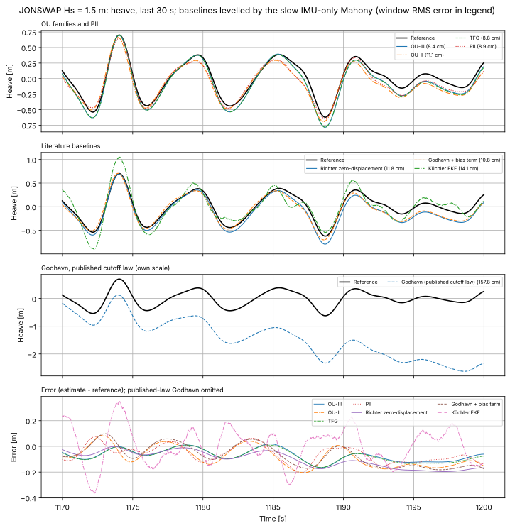
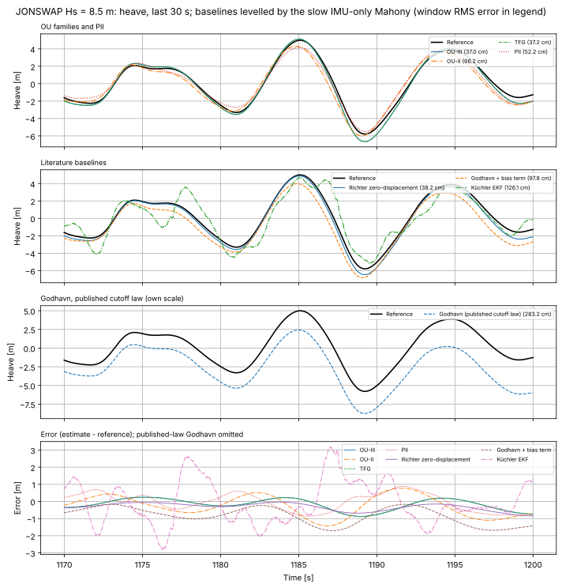

# Literature heave baselines

`src/heave_baselines/` implements two published IMU heave estimators for
comparison with the OU filters on the same replay:

- `GodhavnHeaveFilter.h`: the standard adaptive heave filter of Godhavn
  (OCEANS'98). It is implemented as specified by Richter et al. (IFAC 2014),
  Sections 2.2–2.4, because the original paper is not openly available. The
  same header also provides Richter's zero-displacement filter (Section 3.2).
- `KuchlerHeaveEKF.h`: the harmonic-mode EKF of Küchler et al. (IFAC 2011).
- `AccelSpectrum.h`: the shared FFT identification front end.

The filters take the levelled vertical acceleration (z up, gravity removed)
and return heave. In `tests/heave_baselines` they share one attitude front
end with the PII observer, which runs alongside them. Equation numbers below
are those of the cited papers.

## Godhavn 1998 (as specified by Richter et al. 2014)

Heave is the vertical acceleration through (Eq. 3)

    H(s) = s^2 / (s^2 + 2 zeta w_c s + w_c^2)^2,   zeta = 1/sqrt(2)

This is a double integrator in series with two second-order Butterworth high
passes. It is realised as two identical sections, integrated with RK4. The
double zero rejects a constant bias. The cost is a phase lead,
`|1 - s^2 H(j w_p)| -> 2 sqrt(2) w_c / w_p` (Eq. 7).

The cutoff adapts as in Fig. 4. Every 30 s, the FFT of the buffered
acceleration (128 s at 4 Hz) gives the dominant heave frequency `w_p`. The
buffer also gives the mean wave height (Eq. 14):

    A_p = sqrt(2/N sum a_j^2 / w_p^4)

The cutoff then minimises the total-error bound (Eq. 11):

    J = 8 A_p^2 (w_c/w_p)^2 + sigma_n^2 / (2^(7/2) w_c^3)

The closed-form minimiser is (Eq. 12):

    w_c,opt = 2^(-3/2) (3 sigma_n^2 w_p^2 / A_p^2)^(1/5)

`sigma_n^2` is the datasheet white-noise density. The result is low-pass
filtered with a 60 s relaxation in `log w_c`.

As published, this law accounts only for white sensor noise. On the replay's
MEMS accelerometer it fails:
- It selects `w_c` = 0.010–0.03 rad/s in all but the smallest seas.
- The 5e-4 m/s²/√s bias random walk then passes through the filter's low
  frequency gain as a slow heave drift of metres.

Richter et al. validated the law on a test bench, where bias drift was
presumably negligible.

`godhavn_ext` adds two extensions that are not in either paper:
- **Bias-instability term.** `J` gains the variance
  `q_b / (2^(7/2) w_c^5)`, which a bias random walk of intensity `q_b` leaves
  after `H` (exact for this `H`). The extended `J` is minimised numerically.
- **Input-mean subtraction.** A 300 s running mean is removed ahead of `H`,
  so retuning does not move its DC state.

With both, the adapted cutoff runs from 0.17 rad/s (Hs 0.27 m) down to
0.032 rad/s (Hs 8.5 m).

### Zero-displacement filter (Richter et al. 2014, Section 3.2)

Richter et al. identify the standard filter's phase lead as its main
real-time error, and propose moving one of its zeros off the origin (Eq. 23):

    Hzd(s) = s (s + a) / D(s)^2,   a = 2 sqrt(2) w_c (1 - w_c^2 / w_p^2)   (Eq. 25)

- **Error.** The error on a tone falls from `2 sqrt(2) w_c/w_p` to
  `4 (w_c/w_p)^2` (Eq. 26).
- **Cost.** It amplifies white noise about 9 times more (Eq. 27).
- **Cutoff.** The cutoff minimises Eq. 28, which gives
  `w_c^7 = (27 sqrt(2)/1024) sigma_n^2 w_p^4 / A_p^2` (Eq. 29).
- **Implementation.** `s/D^2` is the second section's position state, so the
  output is the standard heave plus `a` times that state.
- **Drift sensitivity.** With a single zero at the origin, Hzd passes far
  more bias drift than H. Its bias-instability variance is
  `q_b sqrt(2)/16 (w_c^-5 + 3 a^2 w_c^-7)`, exact for Hzd.

`richter_zd` is this filter with the same two extensions as `godhavn_ext`.

On their test bench, Richter et al. report this filter at 59.6 % of the
standard filter's RMS error (Table 1). Their pole-zero filter reaches 43.4 %.
Here, with a good vertical reference, it reaches 60 % (4.98 % against
8.33 % of Hs).

## Küchler et al. 2011

Heave is a sum of undamped modes with `x_j = [z_j, z_j', w_j]` and
`z_j'' = -w_j^2 z_j` (Eq. 5), where `w_j` is a random walk. A random-walk
offset state absorbs gravity and bias (Eq. 8). Its initial value is the
paper's `-g`, which is 0 after gravity removal. The measurement is the sum of
the mode accelerations plus the offset (Eq. 9). Each mode is discretised
exactly (Eq. 6).

The steps are:

- **Identification.** An FFT of the buffered acceleration gives the heave
  amplitude spectrum `|A_acc|/w^2` (Eq. 2). Its peaks set the modes. The EKF
  starts at the first identification.
- **Re-identification.** This runs every 30 s. A new peak extends the model,
  and only its states are initialised. A mode whose frequency approaches zero
  is removed. Converging modes are merged (Eq. 11).
- **Noise.** Process noise is larger for higher-frequency modes. `R` is the
  datasheet sensor noise.

Choices the paper leaves open:

- **Seeding.** New modes are seeded with amplitude and phase from a joint
  least-squares fit of the buffer, instead of reading the FFT bins.
- **Mode limits.** "Approaches zero" means below 0.04 Hz. Modes above 1 Hz
  are also removed. At most 4 modes are kept, and a peak twice as strong as
  the weakest mode replaces it.
- **Process noise.** Velocity process noise is
  `q_j = 4 zeta_q w_j^3 (A_j^2/2)`, with `zeta_q = 0.01` and a frequency
  random walk of `0.002 w_j/sqrt(s)`. These were picked by a sweep on this
  replay (mean 12.1–17.4 % of Hs over the range tried). Using 8 modes did not
  help.
- **Input.** The paper uses the raw body-z accelerometer and neglects roll
  and pitch. `HB_KUCHLER_BODY_Z=1` reproduces that: the mean error is
  13.7 %, against 12.6 % with levelled input. `HB_KUCHLER_OFFSET_FIT=1`
  seeds the offset from the buffer fit instead (12.4 %).

## Comparison on the OU replay

`tests/heave_baselines/heave_baselines-sim` runs every method through
`process_wave_file_for_tracker`, the noise template and seeds of the OU-II,
OU-III and TFG simulators. It uses:

- the 28 ft RAO dataset `v1.2.3`;
- an 8 mg accelerometer turn-on bias and a 5e-4 m/s²/√s bias random walk;
- a 25 Hz magnetometer.

It scores vertical displacement over the same trailing 900 s window. The
baselines need a vertical reference (`--frontend`):

- **`mahony` (default).** The PII observer's Mahony AHRS as shipped:
  sea-state-adaptive gains with a time constant of about 1 s, plus
  magnetometer correction.
- **`mahony_slow`.** The same AHRS with fixed gains (`2Kp = 0.05`, a 40 s tilt
  time constant, critically damped integral) and no magnetometer.
- **`truth`.** The measured accelerometer, still noisy and biased, levelled
  with the record's true attitude. This is an ideal VRU. PII is left out of
  this mode, because it carries its own attitude estimator.

Z RMS error, % of Hs, with the slow front end:

| Record | OU-III | OU-II | TFG | PII | Richter zero-displacement | Godhavn ext | Küchler | Godhavn published law |
|---|---|---|---|---|---|---|---|---|
| JONSWAP 0.27 m | 4.25 | 6.02 | 4.38 | 3.71 | 4.58 | 6.83 | 4.79 | 22.04 |
| JONSWAP 1.5 m | 4.10 | 6.63 | 4.19 | 5.23 | 5.13 | 8.04 | 10.80 | 94.61 |
| JONSWAP 4 m | 4.02 | 6.35 | 4.03 | 5.86 | 5.05 | 8.54 | 15.00 | 224 |
| JONSWAP 8.5 m | 3.71 | 6.05 | 3.73 | 6.02 | 4.94 | 9.28 | 16.91 | 382 |
| PM-Stokes 0.27 m | 4.21 | 5.81 | 4.33 | 3.81 | 5.00 | 7.27 | 5.26 | 29.05 |
| PM-Stokes 1.5 m | 4.02 | 6.43 | 4.09 | 4.75 | 5.29 | 8.28 | 12.63 | 162 |
| PM-Stokes 4 m | 3.96 | 6.20 | 3.98 | 5.54 | 4.79 | 8.20 | 15.41 | 314 |
| PM-Stokes 8.5 m | 3.70 | 5.98 | 3.73 | 5.91 | 5.05 | 10.17 | 18.99 | 492 |
| **Mean** | **4.00** | **6.18** | **4.06** | **5.10** | **4.98** | **8.33** | **12.47** | **215** |
| Worst | 4.25 | 6.63 | 4.38 | 6.02 | 5.29 | 10.17 | 18.99 | 492 |

How each method changes with the front end. Tilt error is the angle between
the estimated and true gravity directions:

| Mean (worst) % of Hs | Tilt error, mean (worst) | PII | Richter zero-displacement | Godhavn ext | Küchler | Godhavn published law |
|---|---|---|---|---|---|---|
| Mahony as shipped (adaptive gains, magnetometer) | 2.94° (6.73°) | 5.99 (8.94) | 10.63 (22.84) | 13.38 (26.52) | 12.59 (20.47) | 232 (551) |
| Slow IMU-only Mahony | 0.47° (0.76°) | 5.10 (6.02) | 4.98 (5.29) | 8.33 (10.17) | 12.47 (18.99) | 215 (492) |
| True vertical | 0.00° (0.00°) | – | 5.00 (5.33) | 8.23 (9.65) | 12.61 (20.12) | 215 (492) |

### Where the error comes from

I separated the error sources offline by feeding the filters the record's own
vertical acceleration, then adding one corruption at a time.

- **Levelling.**
  - *What goes wrong.* The shipped Mahony settings are tuned for a fast AHRS.
    A ~1 s time constant lets every wave's horizontal acceleration tilt the
    vertical. The magnetometer also steers tilt in this Mahony update, and its
    reference does not match the replay's field.
  - *The result.* Tilt error reaches 6.7°. Leaked horizontal acceleration
    leaves about 0.01 m/s² of error below 0.05 Hz. The heave filters' gain
    there (about 235 m per m/s² at 0.01 Hz for Godhavn) turns it into metres
    of drift.
  - *The fix.* The repository's QMEKF AHRS does no better (3.9–4.3° at
    Hs 8.5 m). A slow, IMU-only Mahony, which averages the zero-mean wave
    acceleration over many periods, brings tilt to 0.47°. That makes it as
    good as a true vertical for every heave filter here. The sweep put the
    best gain anywhere in `2Kp` = 0.03–0.12. The PII observer also improves,
    from 5.99 % to 5.10 % of Hs.
  - *Why OU-III differs.* OU-III estimates attitude and wave motion jointly.
- **Bias instability (the published Godhavn law).**
  - On exact acceleration the law gives under 2 % of Hs.
  - Adding the 5e-4 m/s²/√s bias random walk makes Eq. 12 choose
    0.010–0.03 rad/s, and the drift passes almost unattenuated into heave.
    A better vertical reference cannot help with that.
  - The bias term in `godhavn_ext` and `richter_zd` lands within about
    2 points of the best fixed cutoff for each record.
- **Phase lead (standard filter).** Even with a perfect vertical, the
  standard structure stays at about 8 % of Hs. Richter's zero-displacement
  filter removes most of that lead and reaches 5.0 %.
- **The model (Küchler).**
  - *The symptom.* On exact, noise-free acceleration the EKF fits the
    acceleration to under 1 %. Yet its heave error is 33–41 % (Hs 1.5 m) and
    58–69 % (Hs 8.5 m) of heave RMS, with 4 to 27 modes and any tuning tried.
    On a synthetic three-tone sea it reaches 3.3 %.
  - *Why.* This boat's heave is nearly as broadband as the sea. 78 % of heave
    energy is at 0.05–0.12 Hz, but 75 % of acceleration energy is at
    0.12–0.4 Hz. The `-w_j^2 z_j` measurement sees only each mode's spring
    acceleration. The process noise that lets modes follow a random sea adds
    acceleration the measurement never sees.
  - *Context.* Küchler et al. validated on a 175 m ship, whose heave spectrum
    is narrow. No front end changes this result.

### How the papers demonstrated their performance

- **Küchler et al. 2011.** They used two setups:
  - an MSS simulation of a 175 m, 24,609 t vessel in a JONSWAP sea with
    Hs 7 m;
  - a winch rig whose IMU hangs on the rope with its z axis vertical, with an
    encoder as reference.

  In both, the accelerometer is (close to) vertical, so tilt never enters.
  Results are shown as plots only, with no RMS figures.
- **Richter et al. 2014.** They used the Liebherr AHC test bench: a tripod
  driven by three hydraulic winches with MSS-simulated heave, roll and pitch
  (JONSWAP, Hs 6 m, `w_p` = 0.63 rad/s), with a rope encoder as reference.
  - *Levelling.* It uses an attitude estimate "similar to" Küchler et al.'s
    ACC 2011 paper and to Kim and Golnaraghi 2004.
  - *Noise level.* It is taken from the IMU datasheet.
  - *Results.* They are given only relative to the standard filter
    (Table 1, RMS): lead-lag 55.6 %, zero-displacement 59.6 %, pole-zero
    43.4 %.
- **Neither paper isolated the levelling error.** The bench's attitude
  motion and the IMU's bias stability were favourable, and no absolute error
  against Hs was reported. The ACC 2011 attitude paper (Küchler, Pregizer,
  Eberharter, Schneider, Sawodny, pp. 2411–2416) could not be retrieved here.

### Heave over the last 30 s

The charts below show the reference against every estimate over the last 30 s
of the replay. The legends give each method's RMS error over that 30 s window.

With the slow IMU-only Mahony:





With the Mahony as shipped:


All records, for both front ends, are in
[`reports/results/heave_baselines/`](../reports/results/heave_baselines/).
`heave_baselines_mahony_slow_*` are the slow front end; the others are the
Mahony as shipped.

## Reproduce

```bash
make ensure-sim-data
for d in kalman_ou_iii kalman_ou_ii kalman_tfg heave_baselines; do
  (cd tests/$d && make build && W3D_WRITE_TIMESERIES=1 ./run_tests.sh)
done
cd plots/heave_baselines && ./draw_plots.sh   # all front ends; --png adds previews
```

`draw_plots.sh` also writes `<method>_<wave>_<group>_zkin.svg`, with heave
and heave rate per baseline.

These variables change the defaults for sweeps:
- `HB_MAHONY_TWOKP` and `HB_MAHONY_TWOKI` set fixed front-end gains;
- `HB_GODHAVN_FIXED_WC`, `HB_GODHAVN_BIAS_TERM`, `HB_GODHAVN_SUBTRACT_MEAN`
  and `HB_GODHAVN_ZD`;
- `HB_KUCHLER_ZETA_Q`, `HB_KUCHLER_OMEGA_RW`, `HB_KUCHLER_BODY_Z` and
  `HB_KUCHLER_OFFSET_FIT`.

The simulator gates each method on its own regression sentinel.

## References

- J.-M. Godhavn, "Adaptive tuning of heave filter in motion sensor",
  OCEANS'98 Conference Proceedings, vol. 1, pp. 174–178, 1998.
- M. Richter, K. Schneider, D. Walser, O. Sawodny, "Real-time heave motion
  estimation using adaptive filtering techniques", 19th IFAC World Congress,
  pp. 10119–10125, 2014.
- S. Küchler, J. K. Eberharter, K. Langer, K. Schneider, O. Sawodny, "Heave
  motion estimation of a vessel using acceleration measurements", 18th IFAC
  World Congress, pp. 14742–14747, 2011.
