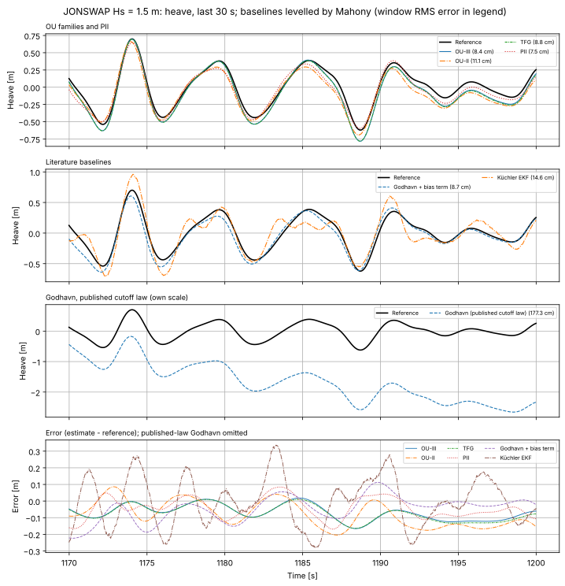
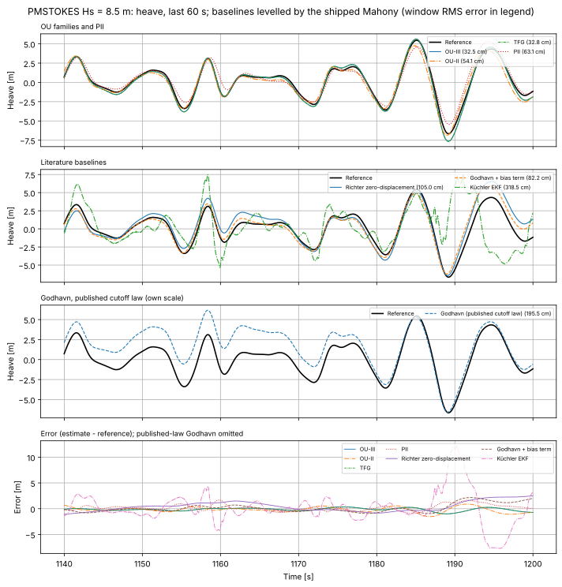
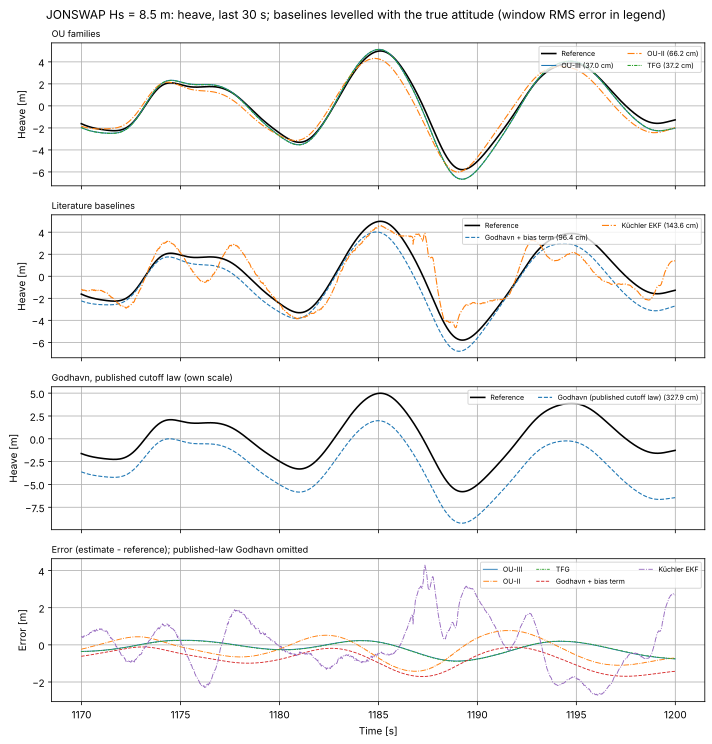

# Literature heave baselines

`src/heave_baselines/` implements two published IMU heave estimators for
comparison with the OU filters on the same replay:

- `GodhavnHeaveFilter.h`: the standard adaptive heave filter of Godhavn
  (OCEANS'98). It is implemented as specified by Richter et al. (IFAC 2014),
  Sections 2.2–2.4, because the original paper is not openly available.
- `KuchlerHeaveEKF.h`: the harmonic-mode EKF of Küchler et al. (IFAC 2011).
- `AccelSpectrum.h`: the shared FFT identification front end.

Both filters take the levelled vertical acceleration (z up, gravity removed)
and return heave. In `tests/heave_baselines` they share the Mahony attitude
front end of the PII observer. The PII observer runs alongside them as a
third Mahony-levelled method. Equation numbers below are those of the cited
papers.

## Godhavn 1998 (as specified by Richter et al. 2014)

Heave is the vertical acceleration through (Eq. 3)

    H(s) = s^2 / (s^2 + 2 zeta w_c s + w_c^2)^2,   zeta = 1/sqrt(2)

This is a double integrator in series with two second-order Butterworth high
passes. It is realised as two identical sections, integrated with RK4. The
double zero rejects a constant bias. The cost is a phase lead,
`|1 - s^2 H(j w_p)| -> 2 sqrt(2) w_c / w_p` (Eq. 7).

The cutoff adapts as in Fig. 4. Every 30 s, the FFT of the buffered
acceleration (128 s at 4 Hz) gives the dominant heave frequency `w_p`. The
buffer also gives the mean wave height (Eq. 14):

    A_p = sqrt(2/N sum a_j^2 / w_p^4)

The cutoff then minimises the total-error bound (Eq. 11):

    J = 8 A_p^2 (w_c/w_p)^2 + sigma_n^2 / (2^(7/2) w_c^3)

The closed-form minimiser is (Eq. 12):

    w_c,opt = 2^(-3/2) (3 sigma_n^2 w_p^2 / A_p^2)^(1/5)

`sigma_n^2` is the datasheet white-noise density. The result is low-pass
filtered with a 60 s relaxation in `log w_c`.

As published, this law accounts only for white sensor noise. On the replay's
MEMS accelerometer it fails:
- It selects `w_c` = 0.010–0.03 rad/s in all but the smallest seas.
- The 5e-4 m/s²/√s bias random walk then passes through the filter's low
  frequency gain as a slow heave drift of metres.

Richter et al. validated the law on a test bench, where bias drift was
presumably negligible.

`godhavn_ext` adds two extensions that are not in either paper:
- **Bias-instability term.** `J` gains the variance
  `q_b / (2^(7/2) w_c^5)`, which a bias random walk of intensity `q_b` leaves
  after `H` (exact for this `H`). The extended `J` is minimised numerically.
- **Input-mean subtraction.** A 300 s running mean is removed ahead of `H`,
  so retuning does not move its DC state.

With both, the adapted cutoff runs from 0.17 rad/s (Hs 0.27 m) down to
0.032 rad/s (Hs 8.5 m).

## Küchler et al. 2011

Heave is a sum of undamped modes with `x_j = [z_j, z_j', w_j]` and
`z_j'' = -w_j^2 z_j` (Eq. 5), where `w_j` is a random walk. A random-walk
offset state absorbs gravity and bias (Eq. 8). Its initial value is the
paper's `-g`, which is 0 after gravity removal. The measurement is the sum of
the mode accelerations plus the offset (Eq. 9). Each mode is discretised
exactly (Eq. 6).

The steps are:

- **Identification.** An FFT of the buffered acceleration gives the heave
  amplitude spectrum `|A_acc|/w^2` (Eq. 2). Its peaks set the modes. The EKF
  starts at the first identification.
- **Re-identification.** This runs every 30 s. A new peak extends the model,
  and only its states are initialised. A mode whose frequency approaches zero
  is removed. Converging modes are merged (Eq. 11).
- **Noise.** Process noise is larger for higher-frequency modes. `R` is the
  datasheet sensor noise.

Choices the paper leaves open:

- **Seeding.** New modes are seeded with amplitude and phase from a joint
  least-squares fit of the buffer, instead of reading the FFT bins.
- **Mode limits.** "Approaches zero" means below 0.04 Hz. Modes above 1 Hz
  are also removed. At most 4 modes are kept, and a peak twice as strong as
  the weakest mode replaces it.
- **Process noise.** Velocity process noise is
  `q_j = 4 zeta_q w_j^3 (A_j^2/2)`, with `zeta_q = 0.01` and a frequency
  random walk of `0.002 w_j/sqrt(s)`. These were picked by a sweep on this
  replay (mean 12.1–17.4 % of Hs over the range tried). Using 8 modes did not
  help.
- **Input.** The paper uses the raw body-z accelerometer and neglects roll
  and pitch. `HB_KUCHLER_BODY_Z=1` reproduces that: the mean error is
  13.7 %, against 12.6 % with levelled input. `HB_KUCHLER_OFFSET_FIT=1`
  seeds the offset from the buffer fit instead (12.4 %).

## Comparison on the OU replay

`tests/heave_baselines/heave_baselines-sim` runs every method through
`process_wave_file_for_tracker`, the noise template and seeds of the OU-II,
OU-III and TFG simulators. It uses:

- the 28 ft RAO dataset `v1.2.3`;
- an 8 mg accelerometer turn-on bias and a 5e-4 m/s²/√s bias random walk;
- a 25 Hz magnetometer.

It scores vertical displacement over the same trailing 900 s window. The
baselines need a vertical reference, and two are compared:

- **Mahony (default).** The PII observer's sea-state-adaptive Mahony AHRS,
  a deployable standalone front end.
- **True vertical (`--frontend truth`).** The measured accelerometer, still
  carrying its noise and bias, is levelled with the record's true attitude.
  This represents an ideal VRU and isolates the heave filter. PII is left out
  of this mode, because it carries its own attitude estimator.

Z RMS error, % of Hs:

| Record | OU-III | OU-II | TFG | PII | Godhavn published law (Mahony) | Godhavn ext (Mahony) | Küchler (Mahony) | Godhavn published law (true vertical) | Godhavn ext (true vertical) | Küchler (true vertical) |
|---|---|---|---|---|---|---|---|---|---|---|
| JONSWAP 0.27 m | 4.25 | 6.02 | 4.38 | 3.74 | 22.03 | 6.95 | 4.79 | 22.07 | 6.83 | 4.79 |
| JONSWAP 1.5 m | 4.10 | 6.63 | 4.19 | 5.58 | 100 | 10.19 | 10.75 | 94.47 | 8.09 | 10.81 |
| JONSWAP 4 m | 4.02 | 6.35 | 4.03 | 6.31 | 225 | 11.21 | 13.86 | 224 | 8.54 | 13.63 |
| JONSWAP 8.5 m | 3.71 | 6.05 | 3.73 | 7.70 | 429 | 21.09 | 17.91 | 384 | 8.98 | 16.53 |
| PM-Stokes 0.27 m | 4.21 | 5.81 | 4.33 | 3.83 | 29.10 | 7.38 | 5.27 | 29.01 | 7.28 | 5.27 |
| PM-Stokes 1.5 m | 4.02 | 6.43 | 4.09 | 5.51 | 186 | 12.10 | 11.54 | 162 | 8.31 | 12.85 |
| PM-Stokes 4 m | 3.96 | 6.20 | 3.98 | 6.31 | 315 | 11.62 | 16.18 | 312 | 8.15 | 16.91 |
| PM-Stokes 8.5 m | 3.70 | 5.98 | 3.73 | 8.94 | 551 | 26.52 | 20.47 | 492 | 9.65 | 20.12 |
| **Mean** | **4.00** | **6.18** | **4.06** | **5.99** | **232** | **13.38** | **12.59** | **215** | **8.23** | **12.61** |
| Worst | 4.25 | 6.63 | 4.38 | 8.94 | 551 | 26.52 | 20.47 | 492 | 9.65 | 20.12 |

### Where the baseline error comes from

I separated the error sources offline by feeding the filters the record's
own vertical acceleration, then adding one corruption at a time. Errors are
given as a percentage of heave RMS, which is about Hs/4.

- **Levelling, for Godhavn.** Mahony's tilt error reaches 5.6° RMS at
  Hs 8.5 m; OU-III's is about 0.3°. The leaked horizontal acceleration
  leaves a 0.01 m/s² error below 0.05 Hz, correlated 0.47 with the squared
  horizontal acceleration. Godhavn's filter amplifies it by its low-frequency
  gain, which is about 235 m per m/s² at 0.01 Hz. The repository's QMEKF AHRS
  does no better (3.9–4.3° pitch error at Hs 8.5 m). Any standalone AHRS
  that corrects tilt with the accelerometer is dragged by wave acceleration.
  OU-III estimates attitude and wave motion jointly, which is a large part of
  its lead. With a true vertical, Godhavn ext falls from 13.4 % to 8.2 % of
  Hs.
- **Bias instability, for the published Godhavn law.** On exact acceleration
  the published law gives 5.5–8 % of heave RMS (below 2 % of Hs). Adding the
  bias random walk takes it to 360–2000 %. Eq. 12 then chooses
  0.010–0.03 rad/s, and a slow bias drift passes almost unattenuated into
  heave. A fixed-cutoff sweep with a true vertical puts the best achievable
  standard filter at 6.9–7.6 % of Hs at Hs 1.5–8.5 m. The ext law lands
  within about 2 points of that.
- **The model, for Küchler.** On exact, noise-free acceleration the EKF still
  has 33–41 % (Hs 1.5 m) and 58–69 % (Hs 8.5 m) of heave RMS error, while
  fitting the acceleration to under 1 %. It gives the same numbers with 4 to
  27 modes and any tuning tried, and on a synthetic three-tone sea it reaches
  3.3 %. The limit is the model:
  - This boat's heave is nearly as broadband as the sea. 78 % of heave energy
    lies at 0.05–0.12 Hz, but 75 % of acceleration energy lies at 0.12–0.4 Hz.
  - The measurement `-w_j^2 z_j` sees only each mode's spring acceleration.
    The process noise that lets the modes follow a random sea adds
    acceleration the measurement never sees, and that integrates into heave
    error.
  - Küchler et al. validated on a 175 m ship, whose response narrows the heave
    spectrum.

  Levelling therefore barely changes Küchler's result.

### Heave over the last 30 s

The charts below show the reference against every estimate over the last 30 s
of the replay. The legends give each method's RMS error over that 30 s window.

With Mahony levelling:





With a true vertical:



The other records, Mahony and true vertical (`heave_baselines_truth_*`), are
in [`reports/results/heave_baselines/`](../reports/results/heave_baselines/).

## Reproduce

```bash
make ensure-sim-data
for d in kalman_ou_iii kalman_ou_ii kalman_tfg heave_baselines; do
  (cd tests/$d && make build && W3D_WRITE_TIMESERIES=1 ./run_tests.sh)
done
cd plots/heave_baselines && ./draw_plots.sh   # both front ends; --png adds previews
```

`draw_plots.sh` also writes `<method>_<wave>_<group>_zkin.svg`, with heave
and heave rate per baseline.

These variables change the defaults for sweeps:
- `HB_GODHAVN_FIXED_WC`, `HB_GODHAVN_BIAS_TERM` and `HB_GODHAVN_SUBTRACT_MEAN`;
- `HB_KUCHLER_ZETA_Q`, `HB_KUCHLER_OMEGA_RW`, `HB_KUCHLER_BODY_Z` and
  `HB_KUCHLER_OFFSET_FIT`.

The simulator gates each method on its own regression sentinel.

## References

- J.-M. Godhavn, "Adaptive tuning of heave filter in motion sensor",
  OCEANS'98 Conference Proceedings, vol. 1, pp. 174–178, 1998.
- M. Richter, K. Schneider, D. Walser, O. Sawodny, "Real-time heave motion
  estimation using adaptive filtering techniques", 19th IFAC World Congress,
  pp. 10119–10125, 2014.
- S. Küchler, J. K. Eberharter, K. Langer, K. Schneider, O. Sawodny, "Heave
  motion estimation of a vessel using acceleration measurements", 18th IFAC
  World Congress, pp. 14742–14747, 2011.
