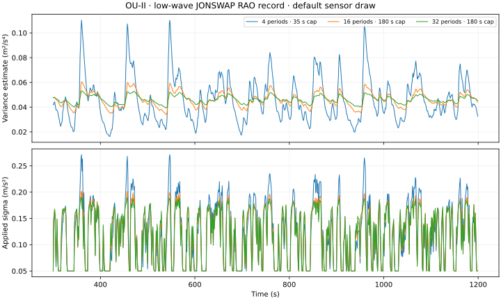
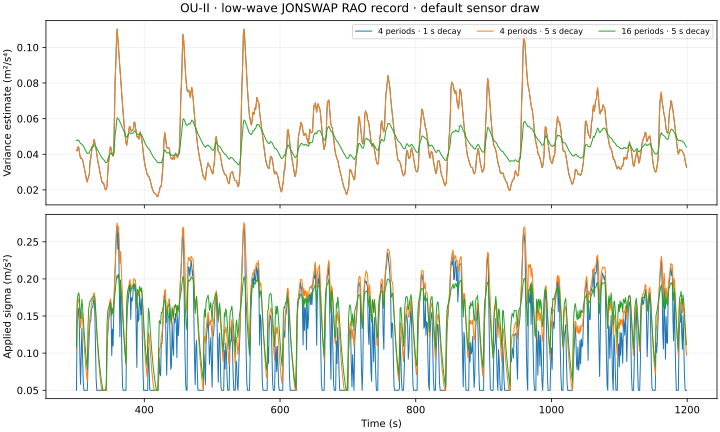

# Sigma averaging on the vessel RAO records

The retained OU-II profile passes all eight default records without changing
the executable limits, sensor injection or scoring windows. The statistical
moment horizon stays at **four wave periods, capped at 35 s**. Its subsequent
stillness attenuation uses **5 s instead of 1 s** in the vessel simulation
profile. The generic core retains its 1 s default and exposes a setter.
OU-III and NLO defaults are unchanged and retain their outstanding gates.

## Which horizon matters

The variance estimator averages its first and second moments over
`K_periods * T_wave`. A downstream common safety clamp limits that horizon
to 35 s, even when the variance-specific maximum is 60 s. The first sweep
therefore saturates: increasing K beyond roughly 12–16 on the low records
does not create a longer averaging horizon.

An isolated build raises that safety cap to 180 s. It tests K=4, 8, 16, 32,
64 and fixed 60, 120, 180 s horizons, in addition to the capped K=6, 8, 12,
16, 24 controls. These experimental cap changes are **not deployed**.

K=16 reduces the standard deviation of the raw low-wave variance estimate
by about 67%. Applied sigma varies only about 12–13% less because a separate
stillness detector attenuates the already-averaged variance with a 1 s time
constant. On the default low JONSWAP record, applied OU-II sigma spends about
24.6% of the scored window at its floor despite continuing physical waves.
The 5 s attenuation reduces that fraction to 2.8%, without changing the
detector or the statistical moment estimator.

These plots use 1 Hz samples for display. All reported moments and simulator
scores use the complete 200 Hz records.

## Selection and separate validation

Each simulator run uses the full 1200 s pinned v1.2.1 vessel record and the
original final-900-s scoring window. Every default screen includes all eight
records. The horizon check uses fresh paired seeds 17011, 18121, 19333, 20507;
the decay check uses 21613, 22817, 23909, 25111; final selection is checked on
26317, 27509, 28607, 29717. Sensor and initialization draws are paired between
settings. All failed cases remain in `studies.json.gz`.

Longer statistical averaging alone does not improve low-wave accuracy:
at K=16, OU-II's fresh mean low-wave vertical error rises from 7.37% to 7.97%
of incident Hs; OU-III is essentially unchanged. In contrast, the isolated
5 s stillness decay reduces OU-II's fresh low-wave vertical error from 7.32%
to 5.79% and roll from 0.323° to 0.260° in the separate decay check.

The selected OU-II profile combines that decay with the previously screened
bias prior and drift-channel settings. A lower time coefficient resolves
the remaining medium-wave vertical gate; increasing it has the opposite
effect and is rejected.

| OU-II setting | Previous profile | Selected vessel profile |
|---|---:|---:|
| Moment averaging K / effective cap | 4 / 35 s | 4 / 35 s |
| Stillness variance-decay time | 1 s | 5 s |
| Magnetic sigma rescale | 4 | 8 |
| Bias driving standard deviations, X/Y/Z | .0005 / .0005 / .0005 | .00015 / .00015 / .0004 |
| Bias model time constant | 5000 s | 20000 s |
| PhysicalMSE channel ratio | .3 | .5 |
| OU time coefficient | 1 | .95 |

| Final paired OU-II check | Previous | Selected |
|---|---:|---:|
| Passing default records | 6/8 | 8/8 |
| Failing fresh records | 28/32 | 24/32 |
| Fresh gate violations | 46 | 39 |
| Worst fresh gate ratio | 2.81 | 2.27 |
| Fresh mean roll RMS | .262° | .228° |
| Fresh mean pitch RMS | .210° | .219° |
| Fresh mean yaw RMS | 1.306° | 1.238° |
| Fresh mean 3D acceleration-bias error | .06084 m/s² | .05773 m/s² |

Pitch worsens about 4.6%; the remaining 24 fresh failing records prevent a
uniform accuracy claim. The integrated-default rerun reproduces all 80 paired
gate outcomes. Compared with the experimental build, its largest vertical
metric difference is .0058 percentage points; it is not claimed bit-identical.

OU-III candidates can pass the default records but worsen separate validation.
For example, the final lower-magnetic-weight candidate raises fresh failing
records from 28 to 31 and violations from 59 to 71. It is not retained.

## Transition and calm checks

The existing kinematically closed low/high/low transition is replayed with
the same wave/IMU/initialization seeds 11/101/1009. The K=16 experiment has
small mixed effects: recovery can worsen even when the rise/fall error
improves. Per-segment scores and configurations are retained in the three
`transition-*` directories; they do not replace the stationary gates.

The separate low-wave/calm/low-wave check compares only 1 s versus 5 s decay.
For OU-II, vertical RMS in settled calm is .0058225 versus .0058246 m;
the first calm-recovery segment is .0003339 versus .0003352 m. Its wave and
fade-to-calm errors improve. These are finite diagnostic checks, not a
stability certificate or a guarantee for every rest interval.

## Reproduction and provenance

`studies.json.gz` contains 18 studies and 1296 complete simulator rows, including
rejected settings and the integrated paired rerun. `diagnostics*` retain
full-rate statistics and reduced display series; `calm-check.json` records
the generated-input hash and exact segments. The earlier bias/reporting
screens are retained separately in `../rao_parameter_tuning/bias2-continuation`.

The screening base `8889188` has the same tree as published commit `07d7d14`;
`screening-source.bundle` preserves its local commit identity. Import that
bundle into a checkout containing prerequisite `a2fbc8f`, then apply exactly
one of `long-horizon-source.patch`, `decay-source.patch` or
`joint-source.patch` to reproduce the corresponding experimental stage.
The integrated stage instead applies `integrated-source.patch` to `07d7d14`.
`environment.json` identifies the compiler and Eigen revision.

Build both OU simulator targets, fetch the pinned data with
`make ensure-sim-data`, and extract each study's recorded `configs`, `records`
and `seeds` from its manifest. Run `tools/rao_parameter_tuning.py` with those
values and `--family`, `--jobs`, `--output-dir`. Exact C-string checks reject
unsupported controls. Never apply the selected environment from an old
baseline study on top of the already-retuned defaults: the integrated study
records `{}` for deployment and explicit settings for the previous profile.

`run_diagnostics.py` and `run_calm_check.py` take the patched experimental
checkout as `--repo`; `plot_diagnostics.py` regenerates the figures from the
retained reduced series. The original averaging-only diagnostic producer is
also retained beside its immutable manifest. Gzip archives preserve the exact
original bytes; decompress the transition CSVs before checking manifest hashes.
Manifests are not restamped
to turn earlier candidate runs into final-source evidence.
