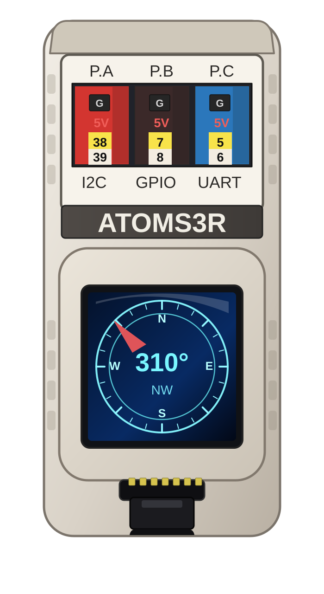

# AtomS3R magnetometer diagnostics

[ocean-imu](../../../README.md) / [sensors](../../README.md) / [imu_basic](../README.md) / **atomS3R_mag_diagnostics**

  

Use this sketch when a compass reads wrong headings and you need to know whether the cause is the magnetometer wiring/axes, the saved calibration, the calibration location, or the alignment between the magnetometer and the accelerometer. It never changes the saved calibration (see [Magnetometer setting and drift](#magnetometer-setting-and-drift) for the sensor setting).

Open the sketch: [`atomS3R_mag_diagnostics.ino`](atomS3R_mag_diagnostics.ino).

## Steps

Open Serial Monitor at **115200 baud**. Tap the screen, or send `n`, to advance.

1. **Boot report** (`[DIAG]`): whether the BMM150 answers on the main I2C bus or only behind the BMI270 AUX bus, the BMI270 AUX polling rate, the magnetometer setting, and the saved calibration.
2. **STILL**, 10 s (`[STILL]`): lay the board flat, screen up, away from metal and do not touch it. Reports the magnetometer update interval, raw and calibrated noise, the heading and dip scatter of single readings, the IMU temperature and update mask counts, and the dip angle with the saved calibration.
3. **ROTATE** (`[ROT]`): turn and tilt slowly (under about 45°/s) through every direction, including upside down and on each edge. This uses the calibration wizard's capture and fit code, and also records slow-motion poses and gyro-measured rotations. It ends by itself when the capture is complete (or tap to stop, or after 3 minutes).
4. **Analysis** (`[FIT]`, `[FIELD]`, `[AXIS]`, `[ALIGN]`, `[VERDICT]`):
   - a fresh calibration fitted here, compared with the saved one (and with the previous run's fit, so a second run at the same place measures calibration repeatability);
   - field-strength spread and dip angle across those poses for both calibrations (a calibration that fits keeps both nearly constant);
   - an axis test that checks every signed axis permutation of the magnetometer against the rotation the gyro measured;
   - the rotation between the magnetometer and accelerometer frames that an ellipsoid fit cannot see, and the heading error it causes.
5. **LIVE** (`[LIVE]`): headings from the saved, fresh, and fresh-plus-alignment models. Hold the board level, then tilt it about ±20° at each cardinal direction; a correct model keeps the heading steady. Tap to run again.

The verdicts compare the dip with `DIAG_EXPECTED_DIP_DEG` (default 66.5°, Fair Lawn NJ). Look up your local inclination (NOAA magnetic field calculator) and build with `-DDIAG_EXPECTED_DIP_DEG=<deg>`; use a negative value in the southern hemisphere.

## Magnetometer setting and drift

Every AtomS3R sketch, the calibration wizard and this one start the BMM150 in a low-noise setting (47 XY / 41 Z repetitions at M5Unified's 30 Hz output rate, instead of the single repetition M5Unified leaves after reset) and apply Bosch's trim-register compensation with RHALL, the sensor's own temperature compensation. A saved magnetometer calibration made before compensation keeps applying to uncompensated data (compensation off) until the magnetometer is recalibrated. While the sketch waits for a tap (or in LIVE), send over serial:

- `q`: read the BMM150 configuration (`[MAGCFG] current`);
- `o`: switch to the M5Unified driver default (1/1 repetitions) until the next reboot, to compare;
- `p`: switch back to the low-noise setting;
- `c`: toggle Bosch trim/RHALL compensation; the saved calibration applies only to the data source it was fitted on, and the choice made here is kept until the next reboot;
- `d`: drift monitor. Leave the board untouched; every 5 s it prints the average raw field, its change since the start, noise, and IMU temperature (`[DRIFT]`). A change that follows temperature is sensor drift; a stable field means heading changes come from where the board is placed. Tap or send `d` again to stop.

Every `[STILL]`, `[FIT]` and `[VERDICT]` block names the setting in use. Two consecutive runs in the same setting show calibration repeatability in `[FIT] previous-run-vs-fresh`.

## Install and upload

Install a prebuilt release without compiling using the
[AtomS3R command-line flashing guide](../../../docs/atoms3r-release-flashing.md).
Select `atomS3R_mag_diagnostics`. For an Arduino IDE source build, complete the common [`sensors/` Arduino setup](../../README.md#arduino-installation), open `atomS3R_mag_diagnostics.ino`, select the AtomS3R board profile and port, then compile and upload.

Copy the whole serial log, from the `[DIAG]` header through the `[VERDICT]` block and a few `[LIVE]` lines, when reporting a compass problem.

## Continue

- [Basic IMU](../atomS3R_imu_m5_basic/README.md)
- [Mahony compass](../../compass_ahrs/atomS3R_compass_mahony/README.md)
- [qMEKF compass](../../compass_ahrs/atomS3R_compass_qmekf/README.md)
